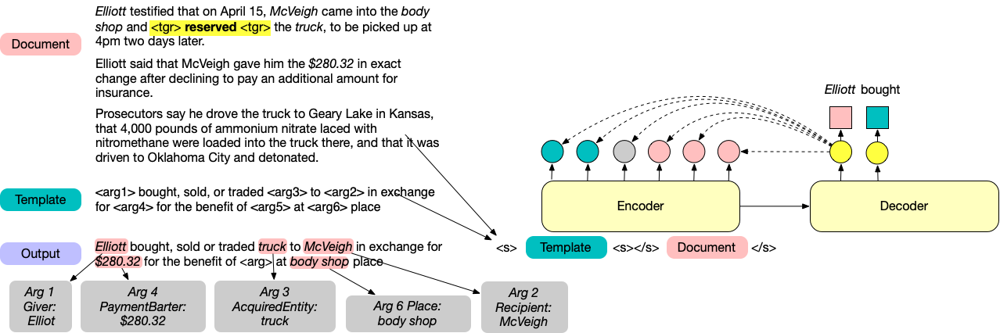

## Intro

> TLDR: 
> This paper treats document-level argument extraction as a conditional generation problem by filling in event templates.

## Dataset

The WikiEvents datasets is under `data/wikievents`.

The RAMS dataset is for download [here](https://nlp.jhu.edu/rams/).

The ACE dataset is provided by LDC and unfortunately we cannot release it directly. See [this link](https://catalog.ldc.upenn.edu/LDC2006T06) for details.

## Code 

- v1 (April 12, 2021): Basic generation model for argument extraction. (This does not include the post-processing script.)
- v2: The event trigger detection model is under the branch `tapkey`. 

